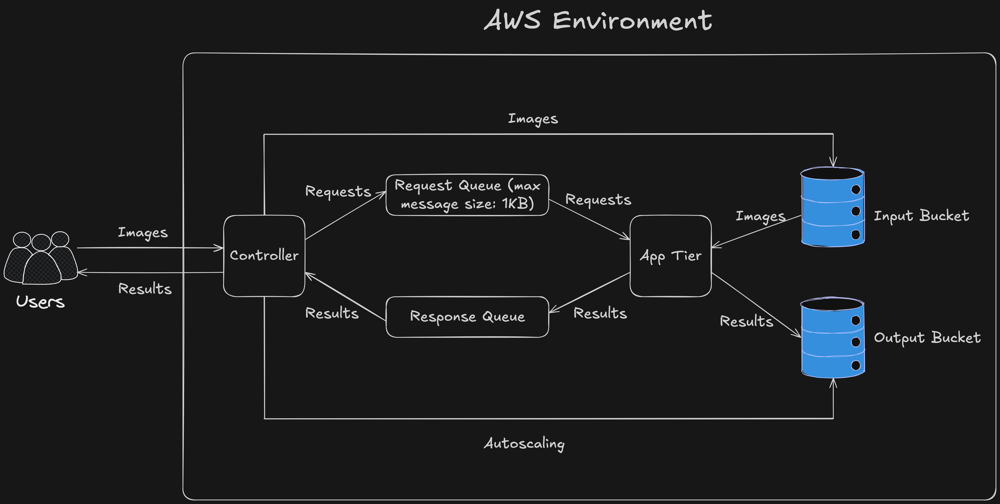

# CSE546-Project1

This project implements a distributed face recognition application using Python and various AWS services, including EC2, S3, and SQS. The system accepts image uploads via HTTP, performs face recognition using a deep learning model on a scalable application tier, and returns the results to the user. It features a custom-built autoscaler to manage the application tier instances based on workload.

## Architecture Overview

This application follows a three-tier architecture deployed on AWS:

1.  **Web Tier:**

    - A single EC2 instance (`web-instance`) running Flask (`server.py`) and a custom autoscaler controller (`controller.py`).
    - Listens for HTTP POST requests with images on port 8000 at the root (`/`).
    - Uploads received images to an S3 Input Bucket.
    - Sends image filenames as messages to an SQS Request Queue.
    - Listens for results on an SQS Response Queue.
    - Returns recognition results (`filename:prediction`) to the original HTTP requestor.
    - Requires a static Elastic IP address.

2.  **Application Tier (App Tier):**

    - A cluster of EC2 instances (`app-tier-instance-#`) launched from a custom AMI.
    - Runs the `backend.py` script.
    - Instances are automatically scaled (started/stopped) by the `controller.py` on the Web Tier based on the SQS Request Queue load (0 to 15 instances).
    - Retrieves image filenames from the SQS Request Queue.
    - Downloads the corresponding image from the S3 Input Bucket.
    - Performs face recognition using the provided PyTorch deep learning model.
    - Uploads the prediction result to an S3 Output Bucket.
    - Sends the result (`filename:prediction`) to the SQS Response Queue.

3.  **AWS Services:**
    - **EC2:** Hosts the Web Tier and dynamically scaled App Tier instances.
    - **S3:**
      - Input Bucket (`<ASU ID>-in-bucket`): Stores uploaded images.
      - Output Bucket (`<ASU ID>-out-bucket`): Stores prediction results.
    - **SQS:**
      - Request Queue (`<ASU ID>-req-queue`): Decouples Web and App Tiers for requests (Max message size: 1KB).
      - Response Queue (`<ASU ID>-resp-queue`): Decouples App and Web Tiers for results.
    - **IAM:** Manages permissions for EC2 instances and the grading user.
    - **AMI:** A custom Amazon Machine Image containing necessary libraries (Python, PyTorch, Boto3) and the model code/weights for the App Tier.



## Deployment

1.  **Clone Repository:** Clone this repository onto the `web-instance`.
    ```bash
    git clone <your-repo-url>
    cd <your-repo-directory>
    ```
2.  **Configure Code:** Ensure bucket names, queue names/URLs, and the App Tier AMI ID are correctly set within `server.py` and `controller.py`.
3.  **Run Web Server:** Start the Flask application. This will also typically start the autoscaler thread defined in `controller.py`. Run the `controller.py` code using `nohup`. Run `server.py` using `systemd` command.
4.  The Web Tier is now running and listening on `<WEB_TIER_ELASTIC_IP>:8000`. The controller will start managing App Tier instances based on SQS queue load.

You can test your code using **POSTMAN**.
